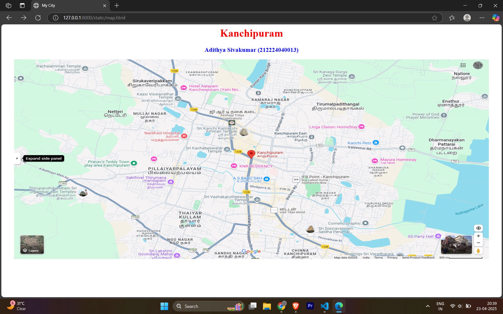
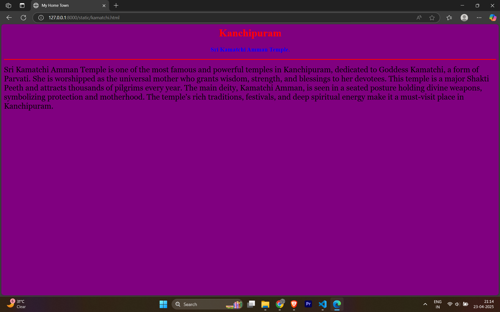
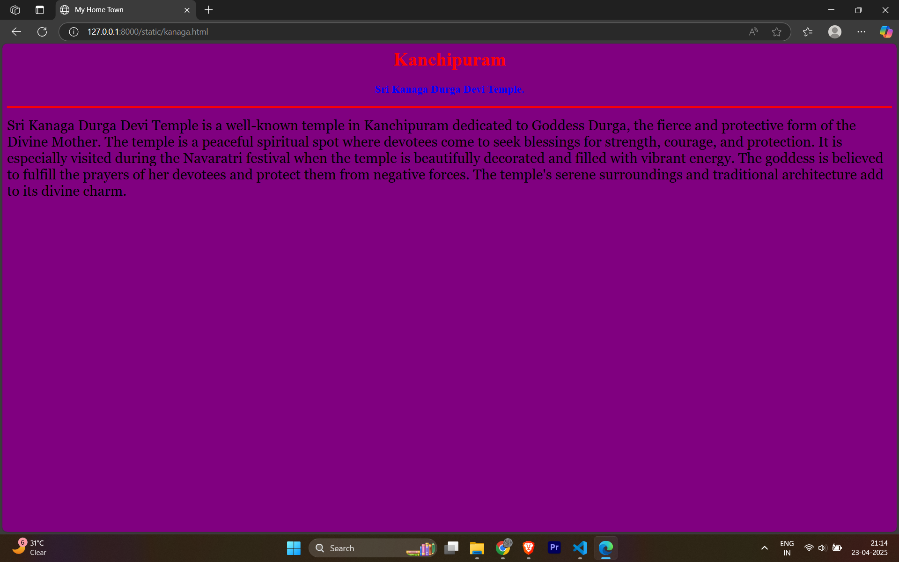
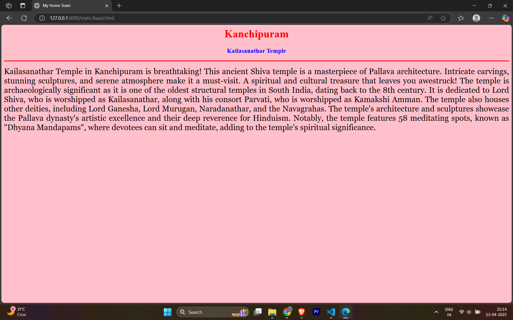
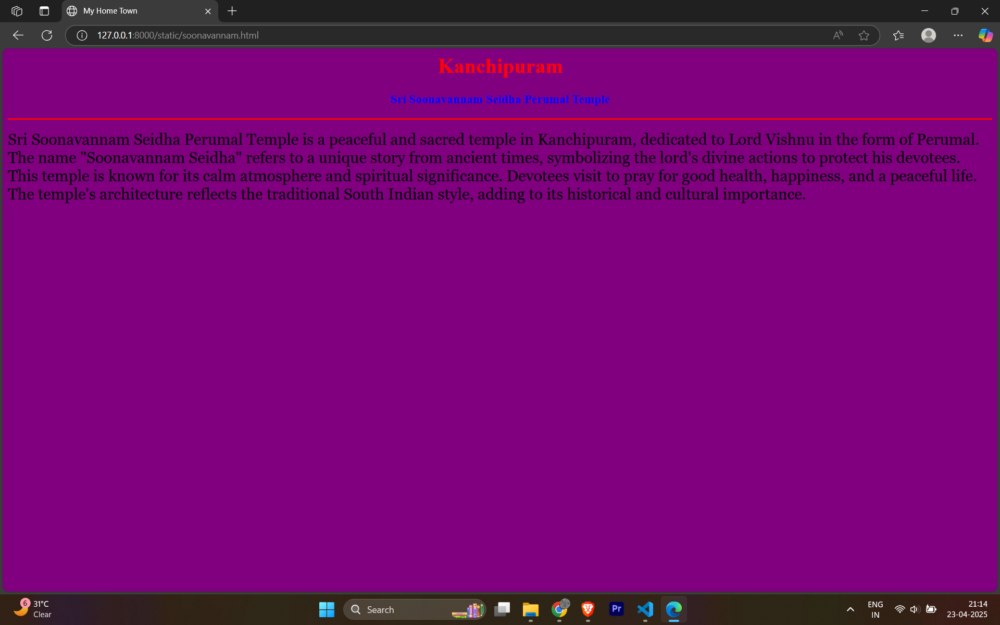
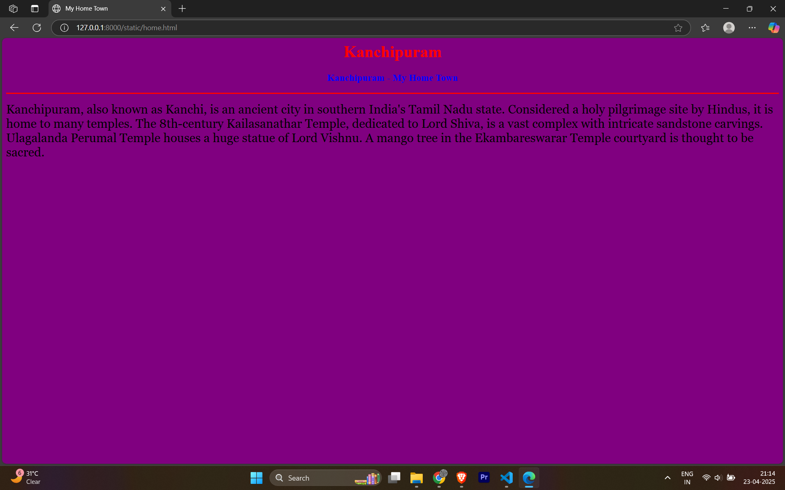

# Ex04 Places Around Me
## Date: 23.04.2025

## AIM
To develop a website to display details about the places around my house.

## DESIGN STEPS

### STEP 1
Create a Django admin interface.

### STEP 2
Download your city map from Google.

### STEP 3
Using ```<map>``` tag name the map.

### STEP 4
Create clickable regions in the image using ```<area>``` tag.

### STEP 5
Write HTML programs for all the regions identified.

### STEP 6
Execute the programs and publish them.

## CODE

### Map.html

```
<html>
    <head>
        <title>
            My City
        </title>
    </head>
    <body>
        <h1 align="center">
            <font color="red"><b>Kanchipuram</b></font>
        </h1>
        <h3 align="center">
            <font color="blue"><b>Adithya Sivakumar (212224040013)</b></font>
        </h3>
        <center>
            
            <map name="MyCity">
            <area shape="rect" coords="700,250,750,320" href="home.html" title="My Home Town">
            <area shape="rect" coords="450,100,525,180" href="kaasi.html" title="Kaasi Viswanadhar Temple">
            <area shape="rect" coords="1000,20,1050,90" href="kanaga.html" title="Sri Kanaga Devi Durga Temple">
            <area shape="rect" coords="850,500,950,570" href="soonavannam.html" title="Sri Soonavannam Seidha Perumal Kovil">
            <area shape="rect" coords="650,200,750,250" href="kamatchi.html" title="Sri Kamatchi Amman Temple">
        </map>
        </center>
    </body>
</html>
```
### home.html
```
<html>
    <head>
        <title>
            My Home Town
        </title>
    </head>
    <body bgcolor="purple">
        <h1 align="center">
            <font color="red"><b>Kanchipuram</b></font>
        </h1>
        <h3 align="center">
            <font color="blue"><b>Kanchipuram - My Home Town</b></font>
        </h3>
        <hr size="3" color="red">
        <p alin="justify">
            <font face="Georgia" size="5">
                Kanchipuram, also known as Kanchi, is an ancient city in southern India's Tamil Nadu state. Considered a holy pilgrimage site by Hindus, it is home to many temples. The 8th-century Kailasanathar Temple, dedicated to Lord Shiva, is a vast complex with intricate sandstone carvings. Ulagalanda Perumal Temple houses a huge statue of Lord Vishnu. A mango tree in the Ekambareswarar Temple courtyard is thought to be sacred.
            </font>
        </p>
    </body>
</html>
```
### kaasi.html

```
<html>
    <head>
        <title>
            My Home Town
        </title>
    </head>
    <body bgcolor="pink">
        <h1 align="center">
            <font color="red"><b>Kanchipuram</b></font>
        </h1>
        <h3 align="center">
            <font color="blue"><b>Kanchipuram - My Home Town</b></font>
        </h3>
        <hr size="3" color="red">
        <p align="justify">
            <font face="Georgia" size="5">
                Kailasanathar Temple in Kanchipuram is breathtaking! This ancient Shiva temple is a masterpiece of Pallava architecture. Intricate carvings, stunning sculptures, and serene atmosphere make it a must-visit. A spiritual and cultural treasure that leaves you awestruck!

                The temple is archaeologically significant as it is one of the oldest structural temples in South India, dating back to the 8th century. It is dedicated to Lord Shiva, who is worshipped as Kailasanathar, along with his consort Parvati, who is worshipped as Kamakshi Amman. The temple also houses other deities, including Lord Ganesha, Lord Murugan, Naradanathar, and the Navagrahas.
                
                The temple's architecture and sculptures showcase the Pallava dynasty's artistic excellence and their deep reverence for Hinduism. Notably, the temple features 58 meditating spots, known as "Dhyana Mandapams", where devotees can sit and meditate, adding to the temple's spiritual significance.
            </font>
        </p>
    </body>
</html>

```
### kamatchi.html
```
<html>
    <head>
        <title>
            My Home Town
        </title>
    </head>
    <body bgcolor="purple">
        <h1 align="center">
            <font color="red"><b>Kanchipuram</b></font>
        </h1>
        <h3 align="center">
            <font color="blue"><b>Kanchipuram - My Home Town</b></font>
        </h3>
        <hr size="3" color="red">
        <p alin="justify">
            <font face="Georgia" size="5">
                Sri Kamatchi Amman Temple is one of the most famous and powerful temples in Kanchipuram, dedicated to Goddess Kamatchi, a form of Parvati. She is worshipped as the universal mother who grants wisdom, strength, and blessings to her devotees. This temple is a major Shakti Peeth and attracts thousands of pilgrims every year. The main deity, Kamatchi Amman, is seen in a seated posture holding divine weapons, symbolizing protection and motherhood. The temple's rich traditions, festivals, and deep spiritual energy make it a must-visit place in Kanchipuram.
            </font>
        </p>
    </body>
</html>
```

### kanaga.html
```
<html>
    <head>
        <title>
            My Home Town
        </title>
    </head>
    <body bgcolor="purple">
        <h1 align="center">
            <font color="red"><b>Kanchipuram</b></font>
        </h1>
        <h3 align="center">
            <font color="blue"><b>Kanchipuram - My Home Town</b></font>
        </h3>
        <hr size="3" color="red">
        <p alin="justify">
            <font face="Georgia" size="5">
                Sri Kanaga Durga Devi Temple is a well-known temple in Kanchipuram dedicated to Goddess Durga, the fierce and protective form of the Divine Mother. The temple is a peaceful spiritual spot where devotees come to seek blessings for strength, courage, and protection. It is especially visited during the Navaratri festival when the temple is beautifully decorated and filled with vibrant energy. The goddess is believed to fulfill the prayers of her devotees and protect them from negative forces. The temple's serene surroundings and traditional architecture add to its divine charm.
            </font>
        </p>
    </body>
</html>
```

### soonavannam.html
```
<html>
    <head>
        <title>
            My Home Town
        </title>
    </head>
    <body bgcolor="purple">
        <h1 align="center">
            <font color="red"><b>Kanchipuram</b></font>
        </h1>
        <h3 align="center">
            <font color="blue"><b>Kanchipuram - My Home Town</b></font>
        </h3>
        <hr size="3" color="red">
        <p alin="justify">
            <font face="Georgia" size="5">
                Sri Soonavannam Seidha Perumal Temple is a peaceful and sacred temple in Kanchipuram, dedicated to Lord Vishnu in the form of Perumal. The name "Soonavannam Seidha" refers to a unique story from ancient times, symbolizing the lord's divine actions to protect his devotees. This temple is known for its calm atmosphere and spiritual significance. Devotees visit to pray for good health, happiness, and a peaceful life. The temple's architecture reflects the traditional South Indian style, adding to its historical and cultural importance.
            </font>
        </p>
    </body>
</html>
```
## OUTPUT

Adithya Sivakumar 212224040013

 


 
 


## RESULT
The program for implementing image maps using HTML is executed successfully.
